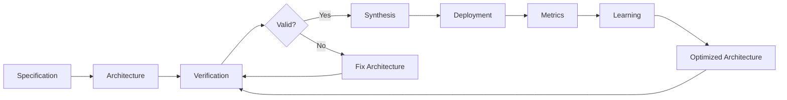

# Core Concepts

Understanding the key concepts behind UPIR's architecture.

---

## Overview

UPIR combines three powerful techniques:

1. **Formal Verification** - Prove correctness using SMT solvers
2. **Program Synthesis** - Generate code from specifications
3. **Reinforcement Learning** - Optimize from production data

---

## The UPIR Workflow



1. **Specify** requirements using temporal logic
2. **Verify** architecture satisfies requirements
3. **Synthesize** implementation code
4. **Deploy** and collect metrics
5. **Learn** to optimize architecture
6. **Iterate** for continuous improvement

---

## Formal Specification

### Temporal Properties

UPIR uses **Linear Temporal Logic (LTL)** to express properties that must hold over time.

#### Operators

- **ALWAYS** (`□`): Property holds at all times
  - Example: `□ data_consistent` - Data is always consistent

- **EVENTUALLY** (`◇`): Property eventually holds
  - Example: `◇ task_complete` - Task eventually completes

- **WITHIN** (`◇_{≤t}`): Property holds within time bound
  - Example: `◇_{≤100ms} respond` - Response within 100ms

- **UNTIL** (`U`): P holds until Q becomes true
  - Example: `processing U complete` - Keep processing until complete

#### Example

```python
from upir.core.temporal import TemporalOperator, TemporalProperty

# Safety property: Data consistency must always hold
safety = TemporalProperty(
    operator=TemporalOperator.ALWAYS,
    predicate="data_consistent"
)

# Liveness property: All events eventually processed
liveness = TemporalProperty(
    operator=TemporalOperator.EVENTUALLY,
    predicate="all_events_processed",
    time_bound=60000  # within 60 seconds
)

# Performance property: Low latency response
performance = TemporalProperty(
    operator=TemporalOperator.WITHIN,
    predicate="respond",
    time_bound=100  # within 100ms
)
```

### Constraints

Hard constraints on resources and performance:

```python
constraints = {
    "latency_p99": {"max": 100.0},      # Max p99 latency
    "latency_p50": {"max": 50.0},       # Max median latency
    "monthly_cost": {"max": 5000.0},    # Max monthly cost
    "throughput_qps": {"min": 10000.0}, # Min queries per second
    "availability": {"min": 0.999}      # Min 99.9% uptime
}
```

---

## Architecture

### Components

A component is a building block of your system:

```python
component = {
    "id": "unique_id",
    "name": "Human-readable name",
    "type": "component_type",  # e.g., "database", "api_gateway"
    "latency_ms": 50.0,        # Component latency
    "cost_monthly": 500.0,     # Monthly cost in USD
    "config": {                # Component-specific config
        "key": "value"
    }
}
```

### Connections

Connections define how components communicate:

```python
connection = {
    "from": "component_a",
    "to": "component_b",
    "latency_ms": 5.0  # Network latency
}
```

### Architecture Example

```python
from upir.core.architecture import Architecture

architecture = Architecture(
    components=[
        {"id": "api", "type": "api_gateway", "latency_ms": 10},
        {"id": "db", "type": "database", "latency_ms": 50}
    ],
    connections=[
        {"from": "api", "to": "db", "latency_ms": 5}
    ]
)
```

---

## Verification

UPIR uses **Z3**, a state-of-the-art SMT (Satisfiability Modulo Theories) solver, to verify that architectures satisfy specifications.

### How It Works

1. **Encode** specification as SMT formulas
2. **Translate** temporal properties to first-order logic
3. **Solve** using Z3's constraint solver
4. **Cache** proven properties for incremental verification

### Verification Results

```python
from upir.verification.verifier import Verifier
from upir.verification.solver import VerificationStatus

verifier = Verifier()
results = verifier.verify_specification(upir)

# Possible statuses:
# - VerificationStatus.PROVED: All properties verified
# - VerificationStatus.FAILED: Counterexample found
# - VerificationStatus.UNKNOWN: Solver timeout or incomplete
```

### Incremental Verification

UPIR caches proofs to speed up repeated verification:

```python
# First verification: ~100ms
results1 = verifier.verify_specification(upir)

# Modify architecture slightly
upir.architecture.components[0]["latency_ms"] = 11

# Second verification: ~10ms (cached proofs reused)
results2 = verifier.verify_specification(upir)
```

---

## Synthesis

UPIR uses **CEGIS** (Counterexample-Guided Inductive Synthesis) to generate implementation code from specifications.

### How CEGIS Works

1. **Sketch**: Start with a program template with "holes"
2. **Synthesize**: Fill holes to satisfy specification
3. **Verify**: Check if synthesis is correct
4. **Counterexample**: If incorrect, use counterexample to refine
5. **Iterate**: Repeat until correct or max iterations

### Synthesis Example

```python
from upir.synthesis.cegis import Synthesizer

synthesizer = Synthesizer(max_iterations=10)

# Generate sketch from specification
sketch = synthesizer.generate_sketch(spec)

# Synthesize implementation
result = synthesizer.synthesize(upir, sketch)

if result.status.value == "SUCCESS":
    print(f"Generated code:\n{result.implementation}")
    print(f"Iterations: {result.iterations}")
```

### Sketch Templates

Sketches define the structure with holes (`??`) to be filled:

```python
def process_??_streaming(events):
    # Configure ??_framework
    pipeline = beam.Pipeline(options=??)

    # Read from ??_source
    events = pipeline | beam.io.ReadFromPubSub(??)

    # Transform with ??_logic
    processed = events | beam.Map(??)

    # Write to ??_sink
    processed | beam.io.WriteToBigQuery(??)

    return pipeline.run()
```

---

## Learning & Optimization

UPIR uses **PPO** (Proximal Policy Optimization), a reinforcement learning algorithm, to optimize architectures from production metrics.

### How It Works

1. **Observe**: Collect production metrics (latency, cost, throughput)
2. **Reward**: Compute reward based on performance
3. **Policy**: Neural network maps architecture to action probabilities
4. **Update**: Adjust architecture to maximize reward
5. **Iterate**: Repeat over many episodes

### Learning Example

```python
from upir.learning.learner import ArchitectureLearner

learner = ArchitectureLearner(upir)

# Simulate production metrics
metrics = {
    "latency_p99": 85.0,
    "monthly_cost": 4500.0,
    "throughput_qps": 12000.0
}

# Learn to optimize
optimized_upir = learner.learn(metrics, episodes=100)

print(f"Original cost: ${upir.architecture.total_cost}")
print(f"Optimized cost: ${optimized_upir.architecture.total_cost}")
```

### Reward Function

The reward balances multiple objectives:

```python
reward = (
    throughput_bonus  # Higher throughput = better
    - latency_penalty  # Lower latency = better
    - cost_penalty     # Lower cost = better
    + correctness_bonus  # Meets all requirements = big bonus
)
```

---

## Pattern Management

UPIR can extract, store, and reuse proven architectural patterns.

### Pattern Extraction

```python
from upir.patterns.extractor import PatternExtractor

extractor = PatternExtractor()
pattern = extractor.extract(upir)

print(f"Pattern: {pattern.name}")
print(f"Success rate: {pattern.success_rate:.2%}")
```

### Pattern Library

```python
from upir.patterns.library import PatternLibrary

library = PatternLibrary()

# Add pattern to library
library.add_pattern(pattern)

# Find matching patterns
matches = library.match_architecture(upir, threshold=0.8)

for pattern, similarity in matches:
    print(f"{pattern.name}: {similarity:.2%} similar")
```

### Built-in Patterns

UPIR includes 10 common distributed system patterns:

1. **Streaming ETL** - Real-time data pipelines
2. **Batch Processing** - Large-scale batch jobs
3. **Request-Response API** - Synchronous request handling
4. **Event-Driven Microservices** - Asynchronous event processing
5. **Lambda Architecture** - Batch + streaming hybrid
6. **Kappa Architecture** - Pure streaming architecture
7. **CQRS** - Command Query Responsibility Segregation
8. **Event Sourcing** - Event-driven state management
9. **Pub/Sub Fanout** - Message broadcasting
10. **MapReduce** - Distributed data processing

---

## UPIR Instance

The `UPIR` class ties everything together:

```python
from upir import UPIR

upir = UPIR(
    specification=spec,  # FormalSpecification
    architecture=arch    # Architecture
)

# Access components
upir.specification.properties  # List of temporal properties
upir.architecture.components   # List of components

# Compute metrics
total_latency = upir.architecture.total_latency_ms
total_cost = upir.architecture.total_cost

# Validate
is_valid = upir.validate()  # Basic validation

# Serialize
upir_json = upir.to_json()
upir_loaded = UPIR.from_json(upir_json)
```

---

## Next Steps

Now that you understand the core concepts:

- [Formal Specifications Guide](../guide/specifications.md) - Deep dive into specifications
- [Verification Guide](../guide/verification.md) - Learn SMT solving
- [Synthesis Guide](../guide/synthesis.md) - Master CEGIS
- [Learning Guide](../guide/learning.md) - Understand PPO optimization
- [Pattern Guide](../guide/patterns.md) - Use pattern library
